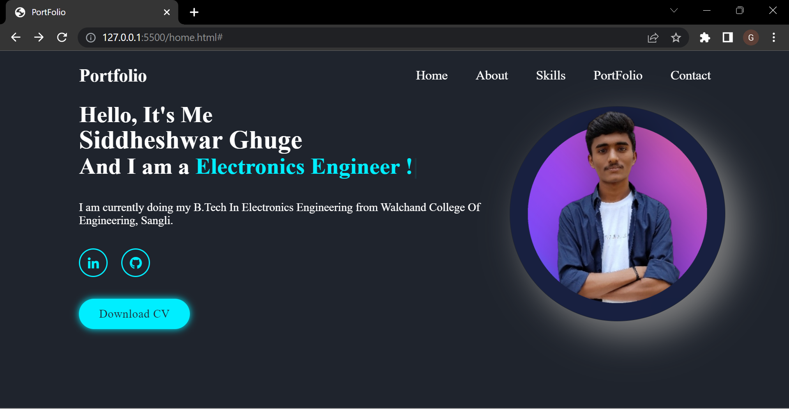

# Portfolio

This is a portfolio website project showcasing my work and skills.

## Description

The Portfolio project is a website built using HTML, CSS, and JavaScript. It serves as a personal portfolio to display information about myself, my projects, and my skills.

The project consists of multiple pages:

- `index.html`: The home page with an introduction and overview of the portfolio.
- `about.html`: The about page providing more details about myself.
- `skills.html`: The skills page highlighting my technical skills.
- `portfolio.html`: The portfolio page showcasing my projects.
- `contact.html`: The contact page for contacting me.

## Usage

- Click on the links in the navigation menu to navigate to different pages of the portfolio.
- Explore the different sections of the portfolio to learn more about me and my projects.
- Use the social media icons to connect with me on LinkedIn and GitHub.
- Download my CV by clicking on the "Download CV" button.

## Contributing

Contributions are welcome! If you have any suggestions, improvements, or bug fixes, please feel free to open an issue or submit a pull request.

## Preview

